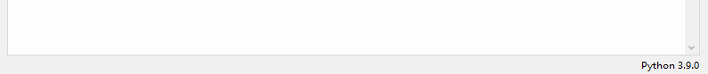
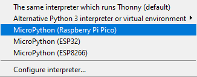
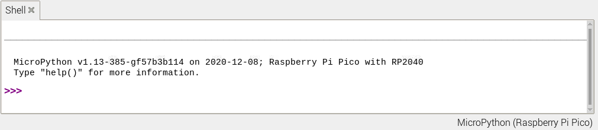

# Connect to the Pico with Thonny
## Just follow the thonny guide at:  
https://projects.raspberrypi.org/en/projects/getting-started-with-the-pico/2

 

## **(ALTERNATIVE)** Follow this guide
### Download and install [Thonny](https://thonny.org/).  
 

In the buttom right corner of Thonny, there should be som text saying `Python 3.9` or simmilar.  
  
**NOTE:** It might say "`The same interpreter which runs Thonny (default)`"

 

Click the text, and a menu should appear.  
In the menu, select the option `"MicroPython (Raspberry Pi Pico)"`  

 

Next click the "STOP" button at the top of Thonny, to reset the Pico and start the console.  

 

The console should now be available at the buttom of thonny.  

