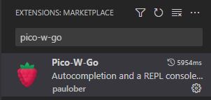

# Connect to the Pico with VSCode (Pico-W-Go)
## Install VSCode
You can download Visual Studio Code from the microsoft website.  

<br>

## Installing pico Extention
1. Open VSCode
2. Click the Extention icon to the left.  
    
3. Search for "Pico-W-Go" and install it.  
    


<br>

# Keybinds
There are some keyboard shortcuts that I use.  
The first, will upload the file you are currently editing.  
The second, runs the selected code.  

### They can be added as follows:
1. Press "ctrl"+"shift"+"p"
2. Type "Open Keyboard Shortcuts (JSON)"
3. Select the first and an empty file should appear.
4. Add this section within the array:
    ```json
    {
        "key": "ctrl+alt+s",
        "command": "picowgo.uploadFile"
    },
    {
        "key": "ctrl+shift+enter",
        "command": "picowgo.runselection"
    }
    ```

<br>

# Prepare project
When you open/make a new project, then you need to initalize it as a pico-project, before the pico-w-go will work. 

### Do this by:
1. Open your project.
2. Press "ctrl"+"shift"+"p"
3. Type "Pico-W-Go > Configure project"
4. Press enter, and the project should be ready.


<br>

# Intellisense
I reccomend you add the "picowireless.py" to you project to add intellisense for this library.  

### Do this by:
1. Create a folder in you project under ".vscode" called "Custom"
2. Copy the file from this repository "Guides/Intellisense/picowireless.py" to the newly created folder in your project ".vscode/Custom/picowireless.py"

<br>

# Connect the pico
The pico should automatically be detected, and a REPL console should appear in the buttom.  
Otherwise click the "X Pico W Disconnected" button in the buttom-left.  

If you have any issues, I recommend looking up the Pico-W-Go github page.